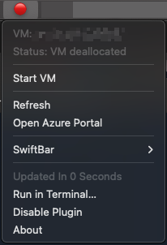

# Azure VM SwiftBar Plugin

🔧 **Manage your Azure VMs directly from your macOS menu bar**

A SwiftBar plugin that provides quick access to Azure VM controls with real-time status updates and one-click operations.



## ✨ Features

- 🟢🔴🟡 **Real-time status indicators** - See VM state at a glance
- ⚡ **One-click operations** - Start, stop, and restart VMs instantly  
- 🔐 **Secure authentication** - Uses Azure CLI (no stored credentials)
- ⏱️ **Configurable refresh** - Update intervals from 10s to 5m
- 🌐 **Universal compatibility** - Works with any Azure subscription

## 📋 Prerequisites

- macOS with [SwiftBar](https://swiftbar.app) installed
- [Azure CLI](https://docs.microsoft.com/en-us/cli/azure/install-azure-cli) installed and configured
- Active Azure subscription with VM access

## 🚀 Installation

1. **Install SwiftBar**
   ```bash
   brew install swiftbar
   ```

2. **Install Azure CLI**
   ```bash
   brew install azure-cli
   az login
   ```

3. **Download the plugin**
   ```bash
   curl -o ~/Documents/swiftbar-plugins/azure-vm.10s.sh \
     https://raw.githubusercontent.com/yourusername/azure-vm-swiftbar/main/azure-vm.10s.sh
   chmod +x ~/Documents/swiftbar-plugins/azure-vm.10s.sh
   ```

4. **Configure SwiftBar**
   - Open SwiftBar preferences
   - Set plugin folder to `~/Documents/swiftbar-plugins`

## ⚙️ Configuration

Edit the plugin file and update these variables:

```bash
RESOURCE_GROUP="your-resource-group-name"
VM_NAME="your-vm-name"
```

Find your values with:
```bash
az vm list --output table
```

## 🎛️ Customization

**Change refresh interval:** Rename the file to adjust update frequency:
- `azure-vm.30s.sh` - Every 30 seconds
- `azure-vm.1m.sh` - Every minute
- `azure-vm.5m.sh` - Every 5 minutes

## 🔍 Status Indicators

| Icon | Status |
|------|--------|
| 🟢 | VM Running |
| 🔴 | VM Stopped/Deallocated |
| 🟡 | VM Starting/Stopping |
| ⚫ | Unknown/Error |

## 🐛 Troubleshooting

**"Azure CLI not found"**
- Ensure Azure CLI is installed: `brew install azure-cli`
- Check PATH includes `/opt/homebrew/bin`

**"Not logged in"**
- Run `az login` and complete authentication

**VM not found**
- Verify resource group and VM name are correct
- Ensure you have access permissions

## 📄 License

MIT License - feel free to modify and share!

## 🤝 Contributing

Issues and pull requests welcome! Please check existing issues before creating new ones.
